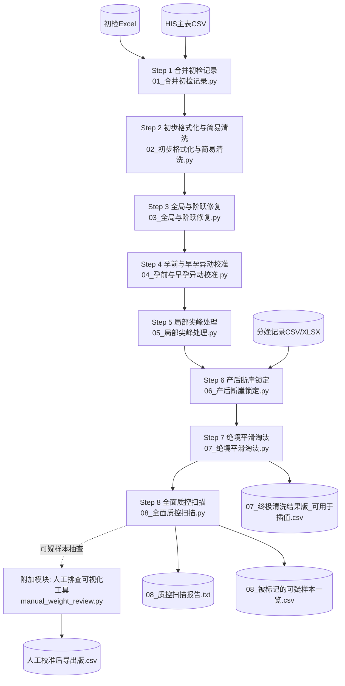

# gestational-weight-records-cleaning-pipline

面向孕期体重时序数据（含 HIS + 初检 + 分娩信息）的多阶段清洗与质控流水线。项目共 8 个脚本，按顺序执行，逐步完成：

1. 初检与系统数据合并
2. 低级录入错误修正
3. 全局/长程“斤-公斤”错单位修复
4. 孕前与早孕异常跳变校准
5. 局部尖峰/深谷修复
6. 产后断崖锁定（免修标记）
7. 极端死错剔除（置空）
8. 全面质控扫描与可视化审计

> 适用对象：首次接手该清洗管线、希望快速复现并用于后续插值/建模的使用者。

## 目录结构

```text
.
├── 01_合并初检记录.py
├── 02_初步格式化与简易清洗.py
├── 03_全局与阶跃修复.py
├── 04_孕前与早孕异动校准.py
├── 05_局部尖峰处理.py
├── 06_产后断崖锁定.py
├── 07_绝境平滑淘汰.py
├── 08_全面质控扫描.py
├── 人工排查/                 <-- 交互式可视化排查与修正工具
└── LICENSE
```

## 环境要求

- Python 3.9+
- Windows（当前脚本路径为 Windows 绝对路径）
- 依赖库：
  - `pandas`
  - `numpy`
  - `matplotlib`
  - `openpyxl`（读取 xlsx）

安装示例：

```powershell
python -m venv .venv
.\.venv\Scripts\Activate.ps1
pip install pandas numpy matplotlib openpyxl
```

## 快速开始（首次使用建议）

1. 克隆仓库并进入目录。
2. 打开每个脚本顶部的 `INPUT/OUT/FILES` 常量，改为你本地真实路径。
3. 确保输入表字段名与脚本一致（见下方“输入数据要求”）。
4. 严格按 `01 -> 08` 顺序执行。

顺序执行示例：

```powershell
python .\01_合并初检记录.py
python .\02_初步格式化与简易清洗.py
python .\03_全局与阶跃修复.py
python .\04_孕前与早孕异动校准.py
python .\05_局部尖峰处理.py
python .\06_产后断崖锁定.py
python .\07_绝境平滑淘汰.py
python .\08_全面质控扫描.py
```

## 输入数据要求

### 主体字段（体重时序主表）

至少包含：

- `项目流水号`：样本唯一标识（字符串）
- `gestation_day`：孕天（数值）
- `weight`：体重（kg）

建议保留（部分步骤依赖）：

- `height`：身高（cm 或 m，脚本会自动识别）
- `LMP`：末次月经日期（Step 6 计算分娩孕天）
- `BMI` / `SBP` / `DBP`：来自初检拼接信息

### 初检文件（Step 1）

`INIT_FILES` 指向的 Excel 至少包含：

- `项目流水号`
- `孕前体重`
- `身高`
- `BMI`
- `收缩压`
- `舒张压`

### 分娩记录文件（Step 6）

`DELIVERY_FILES` 指向的 CSV/XLSX 至少包含：

- `项目流水号`
- `分娩时间`

## 各步骤说明（输入 -> 输出）

### Step 1: `01_合并初检记录.py`

- 目标：将初检中的孕前体重作为 `gestation_day=0` 锚点并并入 HIS 主表。
- 输入：`INIT_FILES`（2 个初检表） + `HIS_PATH`
- 输出：`01_合并后底表_带初检.csv`
- 关键逻辑：若同一流水号已有初检 day0，则剔除 HIS 中重复 day0 记录。

### Step 2: `02_初步格式化与简易清洗.py`

- 目标：修复简单录入错误。
- 输入：`01_合并后底表_带初检.csv`
- 输出：
  - `02_初步清洗_去低级失误版.csv`
  - `初步清洗_日志.txt`
- 关键逻辑：
  - 多敲 0（如 `500` -> `50.0`）
  - 少敲十位（如 `6.5` -> `56.5`，带严格阈值保护）

### Step 3: `03_全局与阶跃修复.py`

- 目标：修复整段“斤”单位和长程阶跃错误。
- 输入：`02_初步清洗_去低级失误版.csv`
- 输出：
  - `03_全局与阶跃修复版.csv`
  - `03_全局与阶跃修复_日志.txt`
  - `03_Plots_全局与阶跃/`
- 关键逻辑：
  - 全局斤系识别与 `/2`
  - 前程/后程阶跃切分修复
  - BMI 生理边界保护，减少误修

### Step 4: `04_孕前与早孕异动校准.py`

- 目标：修复孕前与早孕阶段的异常“高开低走/火箭发射”。
- 输入：`03_全局与阶跃修复版.csv`
- 输出：
  - `04_孕前与早孕异动修复版.csv`
  - `04_早孕异动修复_日志.txt`
  - `04_Plots_早孕异动/`

### Step 5: `05_局部尖峰处理.py`

- 目标：处理孤立尖峰、深谷、双尖峰。
- 输入：`04_孕前与早孕异动修复版.csv`
- 输出：
  - `05_局部尖峰处理版.csv`
  - `05_局部尖峰修复_日志.txt`
  - `05_Plots_局部尖峰/`
- 关键逻辑：邻居一致性 + 时间跨度动态阈值，降低级联误修风险。

### Step 6: `06_产后断崖锁定.py`

- 目标：识别并标记“分娩后正常断崖下降”，避免后续被误删。
- 输入：
  - `05_局部尖峰处理版.csv`
  - `DELIVERY_FILES` 分娩记录
- 输出：
  - `06_产后断崖锁定版.csv`
  - `06_产后断崖锁定_日志.txt`
  - `06_Plots_产后免修锁定/`
- 新增字段：`is_postpartum_normal`（布尔）

### Step 7: `07_绝境平滑淘汰.py`

- 目标：剔除剩余极端死错点（设为 `NaN`）。
- 输入：`06_产后断崖锁定版.csv`
- 输出：
  - `07_终极清洗结果版_可用于插值.csv`
  - `07_极值死错清理_日志.txt`
  - `07_Plots_终极死错剔除/`
- 关键逻辑：已标记 `is_postpartum_normal=True` 的点不会被当作死错删除。

### Step 8: `08_全面质控扫描.py`

- 目标：对终版数据做多维 QC 标记、出报告和审计图。
- 输入：`07_终极清洗结果版_可用于插值.csv`
- 输出：
  - `08_质控扫描报告.txt`
  - `08_被标记的可疑样本一览.csv`
  - `08_QC_A~H_*` 各类问题图目录
- 质控类别：
  - A 极端 BMI
  - B 高速增重
  - C 非产后骤降
  - D 总增重异常
  - E 残余尖峰嫌疑
  - F 平坦复制嫌疑
  - G 身高体重不协调
  - H 数据点稀疏

### 附加模块：`人工排查` 交互式可视化工具

- **位置**：`人工排查/` 文件夹下（入口脚本为 `manual_weight_review.py`）
- **目标**：在清洗阶段中途（如 04 步之后）或自动化最终步骤结束后，针对单纯依靠代码难以判断的存疑样本，提供可视化界面进行人工巡查与精调。
- **核心功能**：
  - 点击左侧轨迹图或右侧数据表，支持将特定记录一键 `×2`、`÷2` 或执行 `逻辑删除`（并自动同步重算 BMI 等字段）。
  - 支持“疑似异常点快速筛查”模式，带可调阈值（如绝对值、跳变幅度）进行高亮点位提示。
  - 操作日志实时追加（`edit_log.csv`），保障原始数据绝对安全，最后生成校正后的全新表单。
- **使用建议**：建议配合 Step 8 输出的 `08_被标记的可疑样本一览.csv`，或者中间各步生成的日志文件，在界面中直接填入存疑的 `项目流水号` 完成精准复核。

## 重要路径与已知注意事项

1. 当前脚本大量使用绝对路径（例如 `E:\文件\...`），迁移环境时必须逐个修改。
2. Step 1 的输出目录与 Step 2 的输入目录默认不一致：
   - Step 1 默认输出到 `...\HIS系统\清洗管线重构_三步走`
   - Step 2 默认读取 `...\市妇幼系统\清洗`
   - 使用前请统一路径，否则会报找不到文件。
3. Step 8 脚本内 `INPUT_CSV` 当前写成了 `EE:\...`（双 `E`），执行前需修正为正确盘符路径。
4. 各步骤会生成大量图像，建议确保输出盘有足够空间。
5. 如果字体缺失导致绘图中文乱码，可在服务器环境改成可用字体或移除中文字体配置。

## 推荐改进（可选）

如果你计划长期维护该仓库，建议优先做两件事：

1. 将所有 `INPUT/OUT` 路径改为“相对路径 + 命令行参数”。
2. 新增统一入口脚本（如 `run_pipeline.py`），支持一键执行 01-08。

## 最终产物

用于后续插值/建模的主文件为：

- `07_终极清洗结果版_可用于插值.csv`

用于人工审计与抽检：

- Step 2-8 日志文件
- Step 3-8 可视化图目录
- Step 8 汇总报告与标记清单

## Pipeline Flow (Mermaid)


