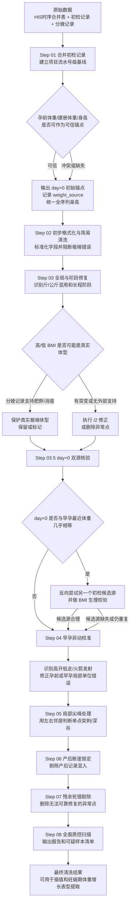

# 宝安妊娠体重时序清洗流程 V2

## 项目目标

本流程用于清洗宝安 HIS 系统中的妊娠期体重时序数据，目标不是简单删除离群点，而是在尽量保留真实个体差异的前提下，识别并修正由录入、单位、时间锚点、复制粘贴、产后记录混入等原因造成的结构性错误。

整套流程的核心思路是：

1. 先建立可信的个体基线，包括项目流水号、孕前/建册体重、统一身高、BMI。
2. 再处理低级格式错误和明显生理不可能值，让后续算法面对的是相对干净的表。
3. 对最常见、影响最大的单位错误和长程阶跃错误优先处理，并引入分娩记录作外部证据，避免把真实肥胖或消瘦误修正。
4. 对 day=0 锚点做双源核验，解决「孕前体重」和「建册体重」被重复引用导致的早期平头问题。
5. 最后按孕期体重曲线的局部形态继续处理早孕异动、局部尖峰、产后断崖和残余死错。
6. 清洗结束后再做全面质控扫描，把需要人工复核的样本集中输出。

---

## 目录结构

```text
.
├── 01_合并初检记录_v2.py             # 合并 HIS 与初检记录，建立 day=0 锚点和统一身高
├── 02_初步格式化与简易清洗_v2.py      # 类型标准化、基础字段清理、极端 BMI 兜底
├── 03_全局与阶跃修复_v2.py            # 全局斤系/公斤单位错误、长程阶跃修复、分娩记录外部验证
├── 03_5_day0双源核验_v2.py            # day=0 双源一致性核验，处理孕前/建册体重重复引用
├── 04_孕前与早孕异动校准_v2.py        # 处理孕前与早孕之间的高开低走、火箭发射
├── 05_局部尖峰处理_v2.py              # 处理局部单点尖峰/深谷
├── 06_产后断崖锁定_v2.py              # 识别产后体重记录混入，锁定断崖式下降
├── 07_绝境平滑淘汰_v2.py              # 对前面无法可靠修复的残余死错做剔除
├── 08_全面质控扫描_v2.py              # 输出清洗后质控报告和可疑样本清单
├── 人工排查/                          # GUI 人工审核工具
└── data/
    └── README_数据说明.txt
```

---

## 数据依赖

所有脚本建议从项目工作目录运行。V2 目录中的脚本默认使用相对路径读取上级目录中的原始数据。

| 数据 | 默认路径 | 用途 |
|------|----------|------|
| 初检记录（第五批） | `..\初检\孕妇初检-第五批-to liu-20260319.xlsx` | 提供孕前体重、建册体重、初检身高等锚点候选 |
| 初检记录（第 1-4 批） | `..\初检\孕期初检-第1-4批-to liu-20260319.xlsx` | 同上，补齐历史批次 |
| HIS 时序合并表 | `..\宝安_HIS前处理_合并表.csv` | 妊娠期体重时序主表 |
| 分娩记录 | `..\宝安妇幼数据搜索\清洗任务\Baoan合并校验\Baoan分娩记录-第1-5批-清洗地址后-icd11_mapped-20260410.xlsx` | 作为肥胖/消瘦外部验证证据 |
| ID 映射表（备用） | `..\baoan_all_ID-15.9w.csv` | 必要时用于项目流水号与个体 ID 映射 |

---

## 运行顺序

```bash
python 01_合并初检记录_v2.py
python 02_初步格式化与简易清洗_v2.py
python 03_全局与阶跃修复_v2.py
python 03_5_day0双源核验_v2.py
python 04_孕前与早孕异动校准_v2.py
python 05_局部尖峰处理_v2.py
python 06_产后断崖锁定_v2.py
python 07_绝境平滑淘汰_v2.py
python 08_全面质控扫描_v2.py
```

每一步都会输出一个新的 CSV、日志文件，部分步骤会输出图像目录用于人工复核。推荐按顺序运行，不建议跳步；如果某一步进行了人工校正，应明确把下一步输入路径改到对应的人工校正版文件。

---

## 清洗思路拆解

### Step 01：合并初检记录，建立可信基线

脚本：`01_合并初检记录_v2.py`

这一步解决的是「第一条体重到底该信谁」的问题。HIS 时序表中有妊娠期体重，初检表中也可能同时存在「孕前体重」和「体重」两列。两者含义不同：孕前体重更接近理论 day=0 基线，建册体重则更接近早孕实测。

因此 Step 01 采用四路决策树：

| 情况 | 处理思路 |
|------|----------|
| 孕前体重可信 | 作为 day=0 初始锚点 |
| 孕前体重缺失但建册体重可信 | 使用建册体重作为备用锚点 |
| 两者都存在但与 HIS 早期体重冲突 | 结合早孕 HIS 参照点仲裁 |
| 身高在不同记录中不一致 | 对同一样本全序列统一身高，减少 BMI 假波动 |

这一步的原则是先尽可能保留样本，不因为单个字段可疑就整例丢弃；但同时记录 `weight_source`，让后续步骤知道 day=0 体重来自哪一个候选源。

### Step 02：初步格式化与低级错误清理

脚本：`02_初步格式化与简易清洗_v2.py`

这一步处理最基础、最不需要复杂判断的问题，例如日期、孕周天数、体重、身高、BMI 等字段的标准化，以及明显不可能的记录。这里特意加入 day=0 极端 BMI 兜底规则：如果 day=0 BMI 小于 10 或大于 50，优先将其阻断在后续曲线修复之前。

这样设计是因为后面的算法会使用个体中位数、相邻点比例、BMI 阈值等统计量；如果极端错误值提前进入，会污染后续判断，导致单位修复或尖峰修复被错误触发。

### Step 03：全局单位错误与长程阶跃修复

脚本：`03_全局与阶跃修复_v2.py`

这一步处理全流程中影响最大的错误类型：斤/公斤单位混用、整段体重被放大约 2 倍、以及某个时间点后出现长程阶跃。

基本判断逻辑是：

1. 先看同一样本的体重水平是否整体落在异常 BMI 区间。
2. 再看曲线内部是否存在相邻点突变。
3. 对高 BMI 或低 BMI 可疑样本，引入分娩记录作为外部验证。
4. 有充分证据支持单位错误时才执行 `/2` 修正或异常点删除。
5. 证据不足但风险较高的样本进入 flag 或人工排查，而不是强行改值。

这里最重要的设计取舍是：不能把「真实肥胖」误当成「斤单位错误」，也不能把「真实消瘦」误当成低值死错。所以 Step 03 不只看数字本身，还看外部诊断/分娩记录、曲线突变形态和 BMI 边界。

高 BMI 可疑样本的处理：

| 分娩记录状态 | 处理 |
|--------------|------|
| 无分娩记录 + 无突变点 | 保留原值 |
| 无分娩记录 + 有突变点 | `/2` 修正 |
| 有记录 + 肥胖确认 | 跳过 `/2` |
| 有记录 + `BMI>25或<18.5` 模糊字段 + BMI 在 25 到 37 且有突变 | `/2` 修正 |
| 有记录 + `BMI>25或<18.5` 模糊字段 + BMI 在 25 到 37 且无突变 | 标记 `BMI_25_37_inconclusive` |
| 有记录 + BMI >= 37 | 认定肥胖，跳过 `/2` |
| 有记录 + 无相关标注 + 有突变 | `/2` 修正 |
| 有记录 + 无相关标注 + 无突变 | 标记 `high_BMI_no_delivery_label` |

低 BMI 可疑样本的处理：

| 条件 | 处理 |
|------|------|
| 有记录 + 消瘦确认 + BMI < 12.5 | 删除异常时序点 |
| 有记录 + 消瘦确认 + 12.5 <= BMI < 13 | 标记 `lean_confirmed_borderline` |
| 有记录 + 无消瘦标注 | 删除异常时序点 |
| 无分娩记录 + BMI < 12.5 | 删除异常时序点 |
| 无分娩记录 + 12.5 <= BMI < 13 | 标记 `very_low_BMI_no_delivery_record` |

关键参数位于 `03_全局与阶跃修复_v2.py`：

| 参数 | 默认值 | 含义 |
|------|--------|------|
| `SPIKE_RATIO` | `1.5` | 相邻体重之比超过该值视为突变候选 |
| `SPIKE_ABS_DIFF` | `20.0` | 相邻体重绝对差超过该值才确认突变 |
| `HIGH_BMI_SUSPECT` | `25.0` | 高 BMI 可疑阈值 |
| `LOW_BMI_SUSPECT` | `13.0` | 低 BMI 可疑阈值 |
| `BMI_EXTREME_HIGH` | `37.0` | 高 BMI 极端但可能真实肥胖的保护阈值 |
| `BMI_EXTREME_LOW` | `12.5` | 极低 BMI 删除阈值 |

### Step 03.5：day=0 双源一致性核验

脚本：`03_5_day0双源核验_v2.py`

这一步是 V2 新增的关键补丁。它专门处理一种很隐蔽的问题：day=0 的孕前体重与早孕第一次体重几乎完全相等，看起来曲线很平，但实际上可能是同一个建册体重被同时填入「孕前体重」和「体重」两个字段。

处理思路是：

1. 找到每个样本的 `day=0` 且 `type=Initial_Raw` 的记录。
2. 寻找 0 到 98 天内最近一次非 day=0 的早孕体重。
3. 如果两者差值小于 `0.5 kg`，认为可能存在双源重复引用。
4. 根据 `weight_source` 反向尝试另一个候选源：当前用了建册体重就尝试孕前体重，当前用了孕前体重就尝试建册体重。
5. 候选值必须通过 BMI 生理范围校验，且不能仍然与早孕参照点重复。

这一步不会盲目替换 day=0。只有当另一个候选源既存在、又能产生合理 BMI、并且能打破早期重复时，才替换；否则仅记录日志，留给后续质控或人工复核。

### Step 04：孕前与早孕异动校准

脚本：`04_孕前与早孕异动校准_v2.py`

这一步关注孕前到早孕之间的局部段落，而不是全局单位错误。典型问题包括：

| 曲线形态 | 可能原因 | 处理 |
|----------|----------|------|
| day=0 明显高于早孕，且接近 2 倍 | 孕前点被录成斤 | 对孕前点 `/2` |
| 早孕前几次明显高于 day=0，且接近 2 倍 | 早孕记录被录成斤 | 对早孕点 `/2` |

之所以放在 Step 03.5 之后，是因为 day=0 锚点如果先被纠正，早孕段判断会更稳定，减少把锚点错误误解为早孕异常。

### Step 05：局部尖峰与深谷处理

脚本：`05_局部尖峰处理_v2.py`

这一步处理单个时间点突然升高或降低，但左右邻居相对一致的情况。它使用左右邻居作为局部参照，如果当前点偏离过大，则执行插值或修正。

设计上会避免「连锁误修」：当左右邻居本身差异过大时，不把当前点强行拉回，因为此时局部参照不可靠。这类样本会留到后面的平滑淘汰或人工复核处理。

### Step 06：产后断崖锁定

脚本：`06_产后断崖锁定_v2.py`

HIS 中可能混入分娩后或产后复诊体重。它们不是妊娠期体重增长曲线的一部分，如果保留，会在曲线末端形成断崖式下降。

这一步的思路是识别晚孕后突然大幅下降、且后续维持在较低水平的记录，将其作为产后混入段处理。这样可以保护真实孕晚期增重趋势，避免插值或表型提取时把产后下降当成孕期体重变化。

### Step 07：残余死错剔除

脚本：`07_绝境平滑淘汰_v2.py`

到这一步仍然残留的问题，通常已经不是简单 `/2` 或局部插值可以可靠解决的错误，例如多点连续错录、前后邻居也不可信、曲线形态无法解释等。

因此 Step 07 的定位是保守剔除：当一个点无法被前面规则合理修复，又明显破坏体重曲线平滑性时，将其从可插值结果中移除。这里强调的是降低最终分析集的假信号，而不是追求所有点都被补救。

### Step 08：全面质控扫描

脚本：`08_全面质控扫描_v2.py`

最后一步不再修改主数据，而是面向审计和人工复核。它集中扫描清洗后仍可能存在的问题，包括：

| 质控项 | 关注问题 |
|--------|----------|
| 极端 BMI | 清洗后仍不合理的体重/身高组合 |
| 非产后骤降 | 可能漏掉的异常下降 |
| 总增重异常 | 整体妊娠期增重过高或过低 |
| 残余尖峰嫌疑 | 仍存在局部突刺 |
| 平坦复制嫌疑 | 多次重复体重可能来自复制粘贴 |
| 身高体重不协调 | 身高或体重组合仍异常 |

这一步的输出包括质控报告、可疑样本清单和分类目录，便于把人工复核集中在最值得看的样本上。

---

## 输出文件链路

| 步骤 | 输入 | 主要输出 |
|------|------|----------|
| 01 | 原始初检表 + HIS 合并表 | `01_合并后底表_带初检.csv` |
| 02 | `01_合并后底表_带初检.csv` | `02_初步清洗_去低级失误版.csv` |
| 03 | `02_初步清洗_去低级失误版.csv` | `03_全局与阶跃修复版.csv` |
| 03.5 | `03_全局与阶跃修复版.csv` | `03_5_day0双源核验版.csv` |
| 04 | `03_5_day0双源核验版.csv` | `04_孕前与早孕异动修复版.csv` |
| 05 | `04_孕前与早孕异动修复版.csv` | `05_局部尖峰处理版.csv` |
| 06 | `05_局部尖峰处理版.csv` | `06_产后断崖锁定版.csv` |
| 07 | `06_产后断崖锁定版.csv` | `07_终极清洗结果版_可用于插值.csv` |
| 08 | `07_终极清洗结果版_可用于插值.csv` | `08_质控扫描报告.txt`、`08_被标记的可疑样本一览.csv` |

---

## 人工复核建议

流程优先使用规则化、可复现的自动清洗。人工复核建议集中在以下位置：

1. Step 03 之后：查看高 BMI、低 BMI、单位错误边界样本，尤其是分娩记录证据不充分的样本。
2. Step 03.5 之后：查看 day=0 与早孕体重高度重复、但没有可用替代源的样本。
3. Step 05 之后：查看局部尖峰修复图，确认是否存在多点连续异常。
4. Step 08 之后：根据质控报告统一处理残余疑难样本。

如果人工校正产生带时间戳的 CSV，应手动把下一步脚本的 `INPUT_CSV` 改为该人工校正版文件，避免后续仍读取自动版输出。

---

## 环境依赖

```bash
pip install pandas numpy matplotlib scipy openpyxl
```

---

## 流程可视化结构图


```mermaid
flowchart TD
    A[原始数据<br/>HIS时序合并表 + 初检记录 + 分娩记录] --> B[Step 01 合并初检记录<br/>建立项目流水号级基线]
    B --> B1{孕前体重/建册体重/身高<br/>是否可作为可信锚点}
    B1 -->|可信| C[输出 day=0 初始锚点<br/>记录 weight_source<br/>统一全序列身高]
    B1 -->|冲突或缺失| C

    C --> D[Step 02 初步格式化与简易清洗<br/>标准化字段并阻断极端错误]
    D --> E[Step 03 全局与阶跃修复<br/>识别斤/公斤混用和长程阶跃]
    E --> E1{高/低 BMI 是否可能是真实体型}
    E1 -->|分娩记录支持肥胖/消瘦| E2[保护真实极端体型<br/>保留或标记]
    E1 -->|有突变或无外部支持| E3[执行 /2 修正<br/>或删除异常点]
    E2 --> F[Step 03.5 day=0 双源核验]
    E3 --> F

    F --> F1{day=0 是否与早孕最近体重几乎相等}
    F1 -->|是| F2[反向尝试另一个初检候选源<br/>并做 BMI 生理校验]
    F1 -->|否| G[Step 04 早孕异动校准]
    F2 -->|候选源合理| G
    F2 -->|候选源缺失或仍重复| G

    G --> G1[识别高开低走/火箭发射<br/>修正孕前或早孕局部单位错误]
    G1 --> H[Step 05 局部尖峰处理<br/>用左右邻居判断单点突刺/深谷]
    H --> I[Step 06 产后断崖锁定<br/>剔除产后记录混入]
    I --> J[Step 07 残余死错剔除<br/>删除无法可靠修复的异常点]
    J --> K[Step 08 全面质控扫描<br/>输出报告和可疑样本清单]
    K --> L[最终清洗结果<br/>可用于插值和妊娠期体重增长表型提取]
```
